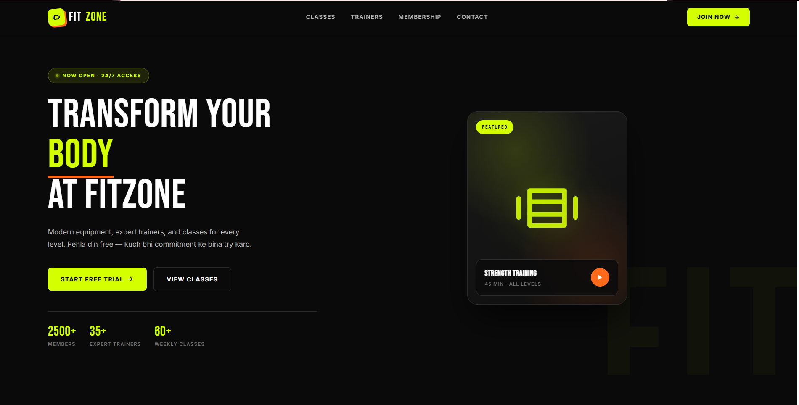
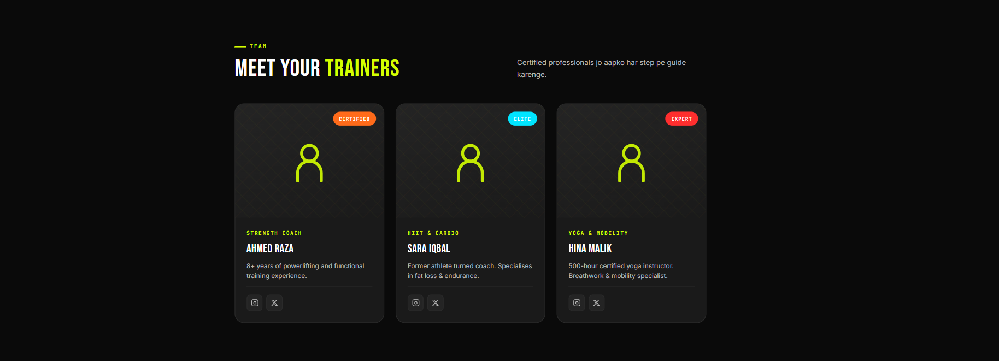
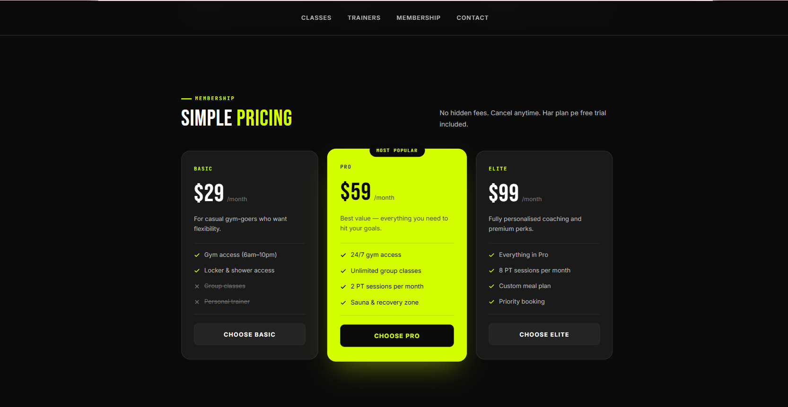
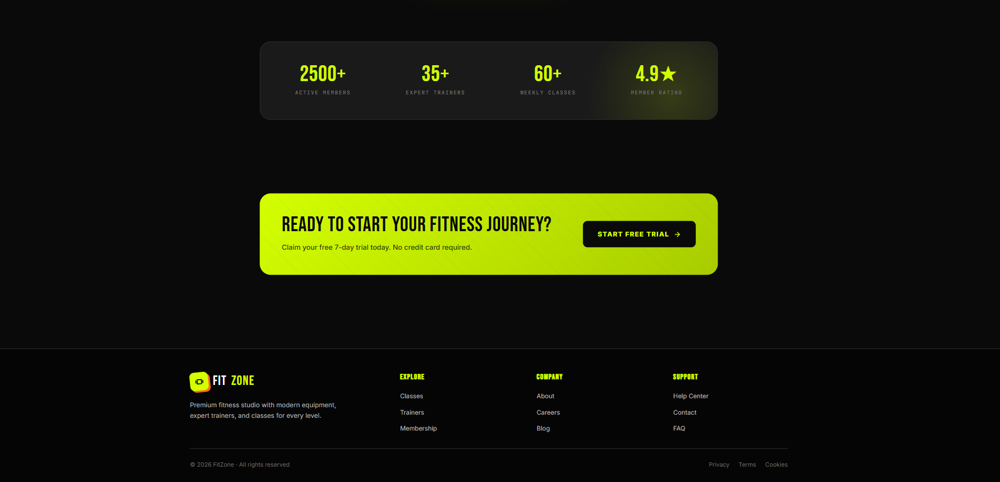
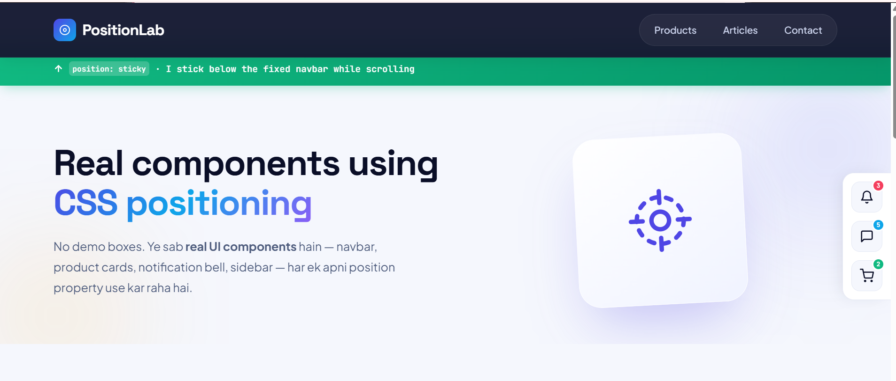
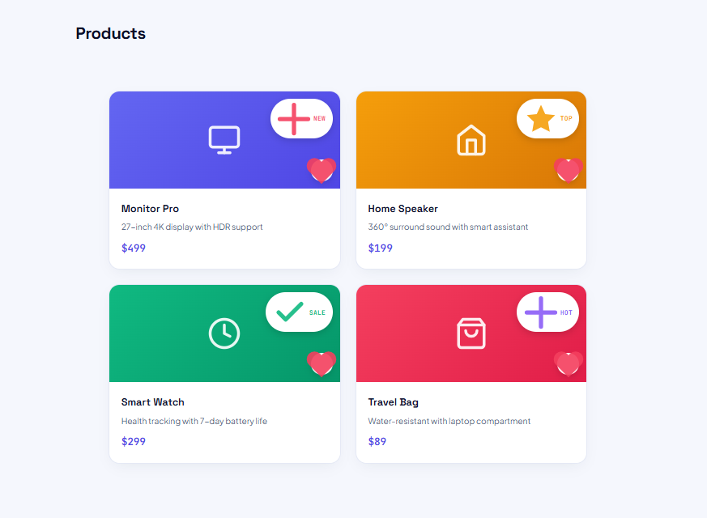
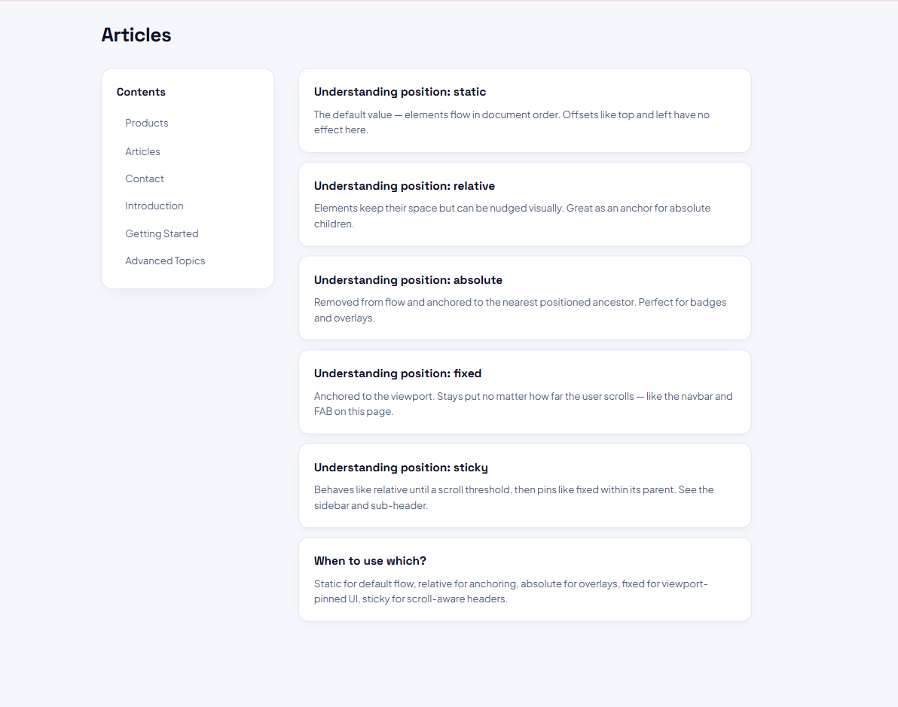
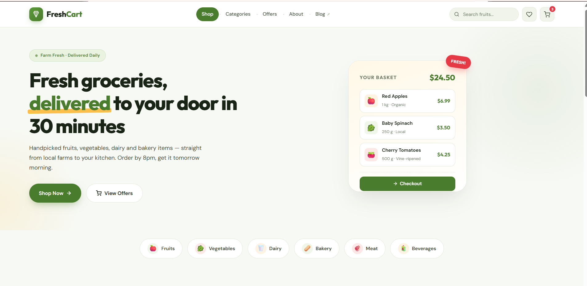
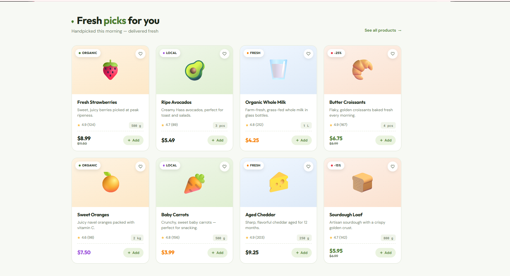
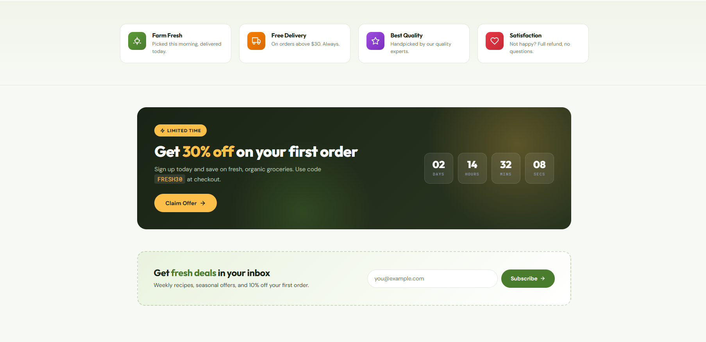

# Web Technologies Assignment

## CSS Flexbox, Positioning & Selectors Practice

**Course:** Web Technologies
**Semester:** 5th Semester
**University:** University of Layyah
**Instructor:** Sir Safi Ullah
**Student:** Sara Manzoor

---

## 📌 Assignment Overview

This assignment focuses on three important CSS concepts:

* **Flexbox**
* **CSS Positioning**
* **CSS Selectors**

The concepts are practiced through multiple landing pages and real-world UI components to understand how CSS properties are applied in practical web development.

---

# 1. Flexbox

Flexbox is a **one-dimensional CSS layout system** used to arrange elements in rows or columns. It provides an efficient way to create flexible, responsive, and well-aligned layouts.

## Flexbox Properties Used

| # | Property          | Values Used                                    | Purpose                                |
| - | ----------------- | ---------------------------------------------- | -------------------------------------- |
| 1 | `display`         | `flex`                                         | Creates a Flex Container               |
| 2 | `flex-direction`  | `row`, `column`                                | Sets the direction of Flex Items       |
| 3 | `justify-content` | `center`, `space-between`, `space-around`      | Aligns items along the Main Axis       |
| 4 | `align-items`     | `center`, `stretch`, `flex-start`, `flex-end`  | Aligns items along the Cross Axis      |
| 5 | `flex-wrap`       | `wrap`                                         | Allows items to move to multiple lines |
| 6 | `gap`             | `0.75rem`, `1.25rem`, `1.5rem`, `2rem`, `20px` | Adds spacing between Flex Items        |
| 7 | `flex-grow`       | `1`, `1.2`, `2`                                | Controls how much an item can grow     |
| 8 | `flex-shrink`     | `0`, `1`                                       | Controls how much an item can shrink   |
| 9 | `flex-basis`      | `260px`, `280px`, `auto`                       | Defines the initial size of an item    |

### Flexbox Concepts Covered

* **Flex Container**
* **Flex Items**
* **Main Axis**
* **Cross Axis**
* **Flex Direction**
* **Justify Content**
* **Align Items**
* **Flex Wrap**
* **Gap**
* **Flex Grow**
* **Flex Shrink**
* **Flex Basis**

### Flexbox Practice

The Flexbox properties are demonstrated through practical landing-page components including navigation bars, hero sections, product grids, pricing cards, testimonials, statistics, CTA sections, and footers.









---

# 2. CSS Positioning

CSS Positioning controls how an element is placed within a webpage. It can be used to keep elements in the normal document flow or position them relative to a parent, viewport, or scrolling area.

## CSS Positioning Values Used

| #  | Property    | Value                             | Purpose                                                          |
| -- | ----------- | --------------------------------- | ---------------------------------------------------------------- |
| 1  | `position`  | `static`                          | Default positioning in normal document flow                      |
| 2  | `position`  | `relative`                        | Positions an element relative to its normal position             |
| 3  | `position`  | `absolute`                        | Positions an element relative to its positioned parent           |
| 4  | `position`  | `fixed`                           | Positions an element relative to the viewport                    |
| 5  | `position`  | `sticky`                          | Keeps an element positioned while scrolling within its container |
| 6  | `top`       | `0`, `50%`, `70px`, `120px`       | Controls distance from the top                                   |
| 7  | `right`     | `12px`, `24px`                    | Controls distance from the right                                 |
| 8  | `bottom`    | `24px`                            | Controls distance from the bottom                                |
| 9  | `left`      | Various values                    | Controls distance from the left                                  |
| 10 | `inset`     | `0`                               | Sets top, right, bottom, and left simultaneously                 |
| 11 | `z-index`   | `0`, `2`, `5`, `50`, `100`, `200` | Controls stacking order                                          |
| 12 | `transform` | `translateY(-50%)`                | Helps with vertical positioning and centering                    |

### CSS Positioning Concepts Covered

* **Static Positioning**
* **Relative Positioning**
* **Absolute Positioning**
* **Fixed Positioning**
* **Sticky Positioning**
* **Top**
* **Right**
* **Bottom**
* **Left**
* **Inset**
* **Z-Index**
* **Transform**

### CSS Positioning Practice

The positioning concepts are demonstrated through fixed navigation bars, sticky sidebars, sticky headers, floating action buttons, product badges, notification dots, decorative hero elements, and positioned UI components.







---

# 3. CSS Selectors

CSS Selectors are patterns used to target HTML elements so that specific styles can be applied to them.

This section demonstrates basic selectors, combinators, pseudo-classes, and pseudo-elements through practical web components.

## CSS Selectors Used

| #  | Selector            | Syntax                           | Purpose                                  |
| -- | ------------------- | -------------------------------- | ---------------------------------------- |
| 1  | Universal Selector  | `*`                              | Targets all elements                     |
| 2  | Element Selector    | `body`, `h1`, `a`                | Targets HTML elements                    |
| 3  | Class Selector      | `.navbar`, `.card`               | Targets elements with a specific class   |
| 4  | ID Selector         | `#products`, `#pricing`          | Targets a unique element                 |
| 5  | Attribute Selector  | `[target="_blank"]`              | Targets elements based on attributes     |
| 6  | Descendant Selector | `.product-card h3`               | Targets nested elements                  |
| 7  | Child Selector      | `.card-body > p`                 | Targets direct children                  |
| 8  | Adjacent Sibling    | `.card-body h3 + p`              | Targets the immediate next sibling       |
| 9  | General Sibling     | `.product-badge ~ .wishlist-btn` | Targets following siblings               |
| 10 | Pseudo-class        | `:hover`                         | Styles an element in a specific state    |
| 11 | Pseudo-class        | `:focus`                         | Styles focused elements                  |
| 12 | Pseudo-class        | `:nth-child()`                   | Targets elements based on their position |
| 13 | Pseudo-class        | `:has()`                         | Targets an element based on its child    |
| 14 | Pseudo-class        | `:not()`                         | Excludes specific elements               |
| 15 | Pseudo-element      | `::before`                       | Adds content before an element           |
| 16 | Pseudo-element      | `::after`                        | Adds content after an element            |
| 17 | Pseudo-element      | `::placeholder`                  | Styles input placeholder text            |
| 18 | Pseudo-element      | `::selection`                    | Styles selected text                     |

### CSS Selector Concepts Covered

* **Universal Selector**
* **Element Selector**
* **Class Selector**
* **ID Selector**
* **Attribute Selector**
* **Descendant Selector**
* **Child Selector**
* **Adjacent Sibling Selector**
* **General Sibling Selector**
* **Pseudo-class**
* **Pseudo-element**
* **`:hover`**
* **`:focus`**
* **`:nth-child()`**
* **`:has()`**
* **`:not()`**
* **`::before`**
* **`::after`**
* **`::placeholder`**
* **`::selection`**

### CSS Selectors Practice

The selectors are demonstrated through navigation bars, product cards, pricing sections, forms, filter sidebars, badges, links, and other practical UI components.







---

# 📁 Project Structure

```text
Web-Technologies-Assignment/
│
├── Flexbox/
│   ├── Flex Box All Properties Practice.html
│   ├── Flexbox1.png
│   ├── Flexbox2.png
│   ├── Flexbox3.png
│   └── Flexbox4.png
│
├── CSS Positioning/
│   ├── Positioning Practice.html
│   ├── positioning1.png
│   ├── positioning2.png
│   └── positioning3.png
│
├── Selectors/
│   ├── Selectors Practice.html
│   ├── Selector1.png
│   ├── Selector2.png
│   └── Selector3.png
│
└── README.md
```

---

# 🛠️ Technologies Used

* **HTML5** — Structure and semantic markup
* **CSS3** — Styling and layouts
* **CSS Flexbox** — Responsive one-dimensional layouts
* **CSS Positioning** — Element positioning and layering
* **CSS Selectors** — Element targeting and styling
* **Google Fonts** — Typography
* **SVG Icons** — Inline icons without external icon libraries

### Fonts Used

* Space Grotesk
* Inter
* Bebas Neue
* Fraunces
* Outfit
* DM Sans

---

# 🎯 Learning Objectives

Through this assignment, the following concepts were practiced:

* Creating layouts using CSS Flexbox
* Understanding Flex Containers and Flex Items
* Understanding Main Axis and Cross Axis
* Controlling alignment and spacing
* Creating responsive layouts using Flex Wrap
* Understanding flexible item sizing
* Using different CSS positioning values
* Creating layered layouts using `z-index`
* Working with fixed and sticky elements
* Understanding CSS selectors and combinators
* Using pseudo-classes for interactive states
* Using pseudo-elements for decorative content
* Building responsive landing pages using HTML and CSS

---

# 👩‍💻 Student Information

|                |                      |
| -------------- | -------------------- |
| **Student**    | Sara Manzoor         |
| **Course**     | Web Technologies     |
| **Semester**   | 5th Semester         |
| **University** | University of Layyah |
| **Instructor** | Sir Safi Ullah       |

---

## Conclusion

This assignment provides practical experience with **CSS Flexbox, CSS Positioning, and CSS Selectors**.

Each concept has been implemented through practical landing-page components to demonstrate how CSS is used in real-world web development for creating structured, responsive, and interactive user interfaces.
